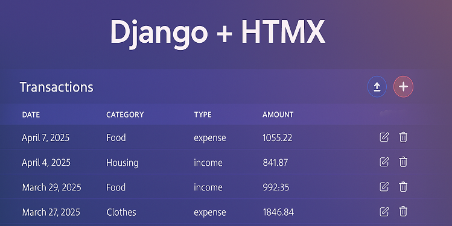
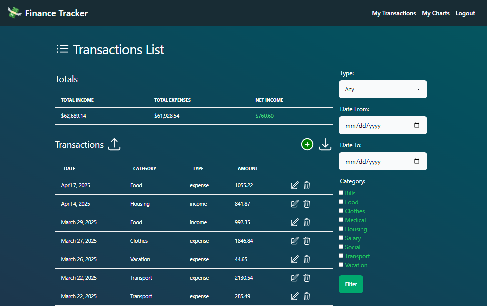
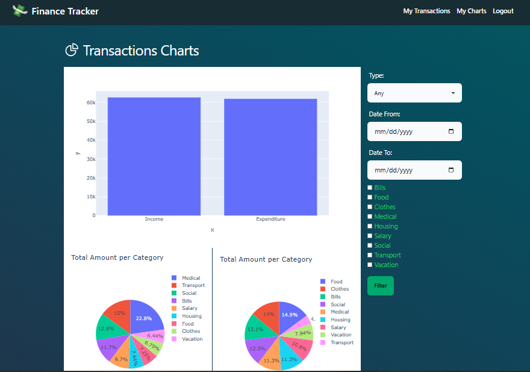

# 📊 Django HTMX Finance App

A personal finance tracker built with [**Django**](https://www.djangoproject.com/) and [**HTMX**](https://htmx.org/). This app allows users to track their transactions, categorize them, filter them, and visualize their spending habits.

## 🚀 Features

* User authentication and authorization using [django-allauth](https://pypi.org/project/django-allauth/)
* Transaction tracking and management
* Filtering capabilities using [django-filter](https://pypi.org/project/django-filter/)
* Import and export transactions using [django-import-export](https://pypi.org/project/django-import-export/)
* Graphs and plots using [plotly](https://pypi.org/project/plotly/)
* Responsive and customizable UI using [TailwindCSS](https://tailwindcss.com/) and [DaisyUI](https://daisyui.com/)

## 💻 Technologies Used

* **Backend**: Django
* **Frontend**: HTMX using Django HTMX
* **Database**: SQLite
* **Authentication**: Django AllAuth
* **Filtering**: Django Filter
* **Import/Export**: Django Import Export
* **Graphs/Plots**: Plotly
* **Testing**: Pytest Django
* **Templates**: Django Template Partials and Django Widget Tweaks

## 📦 Setup

To set up the app, follow these steps:

1. Clone the repository: `git clone [repository-url]`
2. Navigate to the project root directory.
3. Create a virtual environment:
	* On Windows: `python -m venv venv`
	* On Linux: `python3 -m venv venv`
4. Activate the virtual environment:
	* On Windows: `venv\Scripts\activate`
	* On Linux: `source venv/bin/activate`
5. Install the required dependencies: `pip install -r requirements.txt`
6. Create a new database: `python manage.py migrate`
7. Populate the database with sample data: `python manage.py generate_transactions`
8. Run the development server: `python manage.py runserver`

## 👀 Usage

1. Navigate to `http://localhost:8000` in your web browser
2. Log in with the following credentials:
	* Username: `user`
	* Password: `test`
	* Note: This is a test user account, feel free to create your own account or use this one to test the app.
3. Create and manage transactions

## 📸 Screenshots

## 🤝 Contributing

Contributions are welcome! If you'd like to contribute to the app, please fork the repository and submit a pull request.

## 📝 License

This app is licensed under the MIT [License](./LICENSE).

**Note:** This project is based on a YouTube tutorial by **BugBytes**, which can be found at [here](https://www.youtube.com/watch?v=6OlILeP9GKg&list=PL-2EBeDYMIbSBjHGYJYl1WLUT-tbCLHOb).
